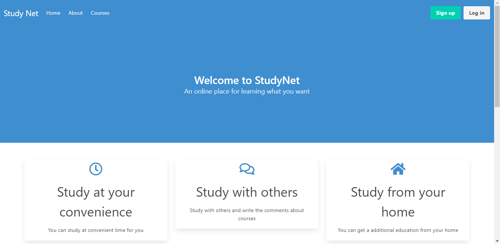

# StudyNet

A small LMS with the following functionality:

- Auth
- Quizzes
- Access to course
- Comment to course
- Quiz in course
- Embedding videos to lesson
- Tracking progress



[comment]: <> (![avatar]&#40;studynet_imgs/studynet-2.png&#41;)

[comment]: <> (![avatar]&#40;studynet_imgs/studynet-3.png&#41;)

[comment]: <> (![avatar]&#40;studynet_imgs/studynet-4.png&#41;)

[comment]: <> (![avatar]&#40;studynet_imgs/studynet-5.png&#41;)

[comment]: <> (![avatar]&#40;studynet_imgs/studynet-6.png&#41;)

[comment]: <> (![avatar]&#40;studynet_imgs/studynet-7.png&#41;)

### For Vue

```
cd studynet_vue
yarn install
yarn serve
yarn build
```

### For Django

```
cd studynet_django
pip install -r requirements.txt
python manage.py makemigrations
python manage.py migrate
python manage.py createsuperuser
python manage.py runserver
```
