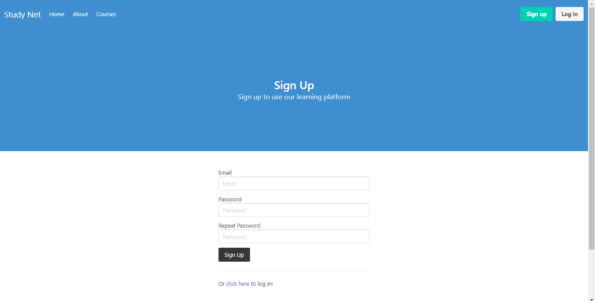
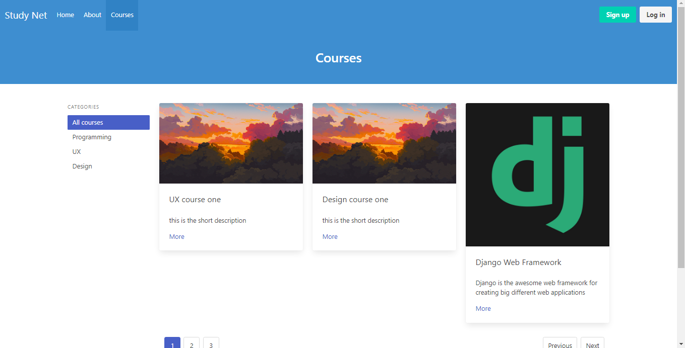

# GanarCRM






### For Vue

```
cd studynet_vue
yarn install
yarn serve
yarn build
```

### For Django

```
cd studynet_django
pip install -r requirements.txt
python manage.py makemigrations
python manage.py migrate
python manage.py createsuperuser
python manage.py runserver
```
